<!--
 * @Author: xinyan
 * @Date: 2023-06-15 15:11:57
 * @LastEditors: xinyan
 * @LastEditTime: 2023-06-20 23:57:16
 * @Description: file content
-->

# TablePic
## Overview
This package uses PIL (pillow) to generate a picture that contains a table. It has similar functionality to matplotlib's table, but includes more customization options.

## Installation

Use pip to install the package.

```shell
pip install tablepic
```

## Release Note

### v0.0.9
In previous versions, if the title was wider than the table content, the title would be truncated.

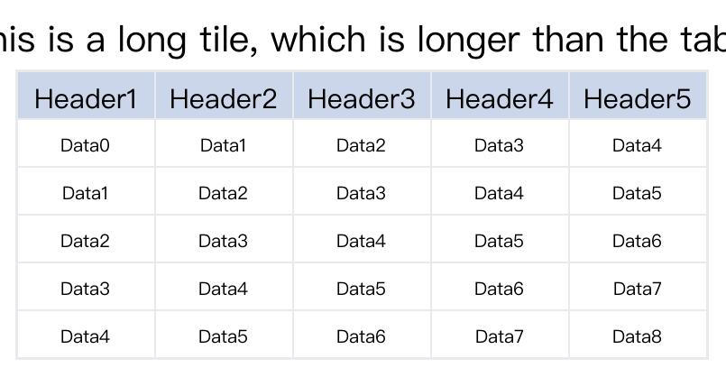


This bug has been fixed in v0.0.9.

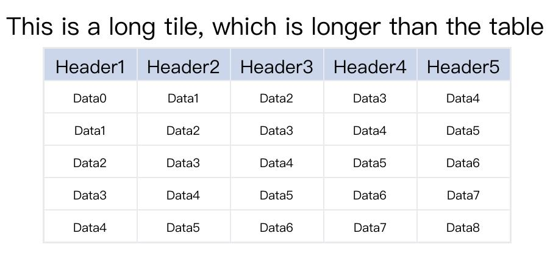

代码：
```python
# Before version v0.0.9
title_list = [{'content': 'This is a long tile, which is longer than the table'}]
header_dict = {'content': [f'Header{i+1}' for i in range(5)]}
data_dict = {'content':[[f'Data{i+j}' for j in range(5)] for i in range(5)]}
tp.generate_table_pic(6, 5, title_list=title_list, header_dict=header_dict,
                      data_dict=data_dict, img_path='./pic/long_title_table1.jpg')


# After version v0.0.9
title_list = [{'content': 'This is a long tile, which is longer than the table'}]
header_dict = {'content': [f'Header{i+1}' for i in range(5)]}
data_dict = {'content':[[f'Data{i+j}' for j in range(5)] for i in range(5)]}
tp.generate_table_pic(6, 5, title_list=title_list, header_dict=header_dict,
                      data_dict=data_dict, img_path='./pic/long_title_table2.jpg')
```


### v0.0.8
Some bug fixes were made between v0.0.4 and v0.0.7, with no significant functional changes.

In v0.0.8, the function of merging images is added, which is used to merge multiple generated table images into one image. The function parameters are as follows:

combine_multiple_pic

combine_path: str, path of the merged image
path_list: list[str], list of paths of images to be merged
img_list: list[Image], list of image objects to be merged (PIL Image objects, can be generated and returned using the generate_table_pic() function or customized)
pic_bk_color: background color of the generated image, default is white.

#### Merging existing images
Usage example:

```python
import tablepic as tp

pic_path_list = ['/tmp/pic1.png', '/tmp/pic2.png']
combine_path = '/tmp/combine_table.png'
tp.combine_multiple_pic(combine_path, pic_path_list)
```

The result is as follows:

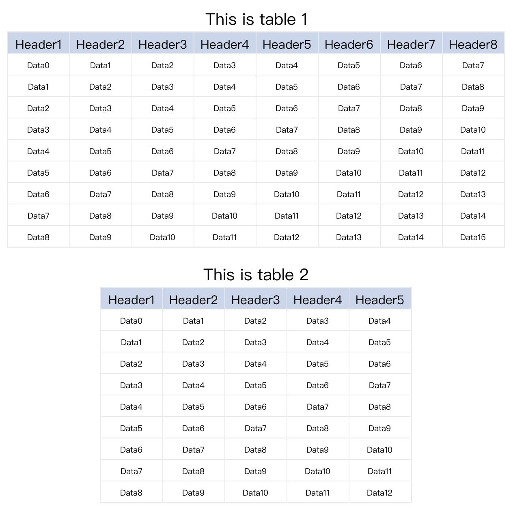

#### Generating images and then merging

Usage example:

```python
import tablepic as tp

# pic1
title_list = [{'content': 'This is table 1'}]
header_dict = {'content': [f'Header{i+1}' for i in range(8)]}
data_dict = {'content':[[f'Data{i+j}' for j in range(8)] for i in range(9)]}
img1 = tp.generate_table_pic(10, 8, title_list=title_list, header_dict=header_dict, data_dict=data_dict)

# pic2
title_list = [{'content': 'This is table 2'}]
header_dict = {'content': [f'Header{i+1}' for i in range(5)]}
data_dict = {'content':[[f'Data{i+j}' for j in range(5)] for i in range(9)]}
img2 = tp.generate_table_pic(10, 5, title_list=title_list, header_dict=header_dict, data_dict=data_dict)

combine_path = './pic/combine_table.jpg'
tp.combine_multiple_pic(combine_path, img_list=[img1, img2])
```

The result is as follows:


### v0.0.4
In previous versions, the default width of all columns was the same and fixed. If the length of the contents in the table was too long, it would cause overlapping of the content, and the table could not adjust its width according to the contents. In v0.0.4, the recognition of the width and height of the table content was added, automatically setting the appropriate height for each column and row.

Result of version v0.0.4:

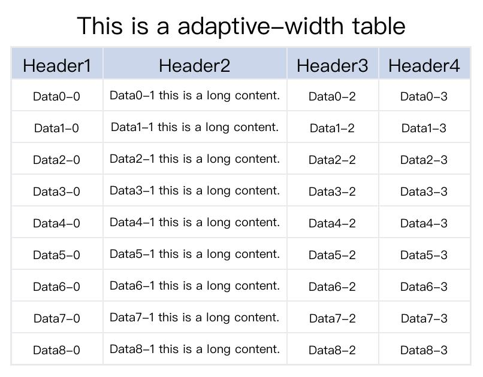

Result of version v0.0.3 and before:

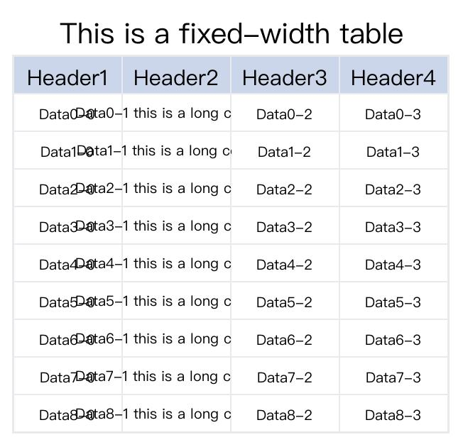

## Instruction

### Basic Table

The following code generate a basic table picture, it contains a title and a 10*8 regular table. The table has 1 header row and 9 data rows.

```python
import tablepic as tp

title_list = [{'content': 'This is a title.'}]
header_dict = {'content': [f'Header{i+1}' for i in range(8)]}
data_dict = {'content':[[f'Data{i+j}' for j in range(8)] for i in range(9)]}

tp.generate_table_pic(10, 8, title_list=title_list, header_dict=header_dict,
                      data_dict=data_dict, img_path='./pic/basic_table1.jpg')
```

the picture generated:

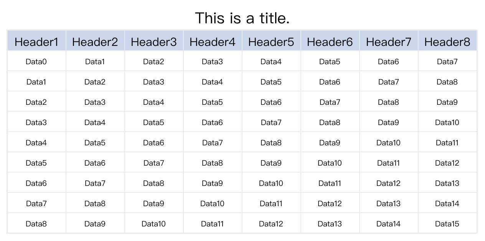

As you see, you can set multiple titles throught the parameter `title_list`. For examples:

```python
import tablepic as tp

title_list = [{'content': 'This is a title.'}, {'content': 'This is a second title.'}, {'content': 'This is a third title.'}]
header_dict = {'content': [f'Header{i+1}' for i in range(8)]}
data_dict = {'content':[[f'Data{i+j}' for j in range(8)] for i in range(9)]}

tp.generate_table_pic(10, 8, title_list=title_list, header_dict=header_dict,
                      data_dict=data_dict, img_path='./pic/basic_table2.jpg')
```

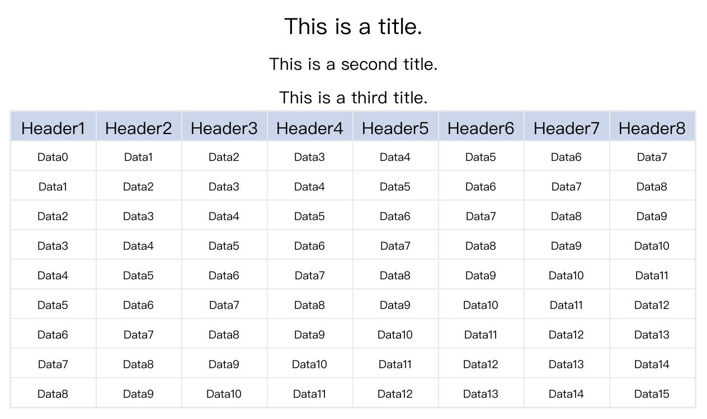

And you can also add a footnote to the table.

```python
import tablepic as tp

title_list = [{'content': 'This is a title.'}, {'content': 'This is a second title.'}, {'content': 'This is a third title.'}]
header_dict = {'content': [f'Header{i+1}' for i in range(8)]}
data_dict = {'content':[[f'Data{i+j}' for j in range(8)] for i in range(9)]}
footnote_list = [{'content': 'This is a footnote.'}]
tp.generate_table_pic(10, 8, title_list=title_list, header_dict=header_dict,
                      data_dict=data_dict, img_path='./pic/basic_table3.jpg',
                      footnote_list=footnote_list)
```

The result will be:

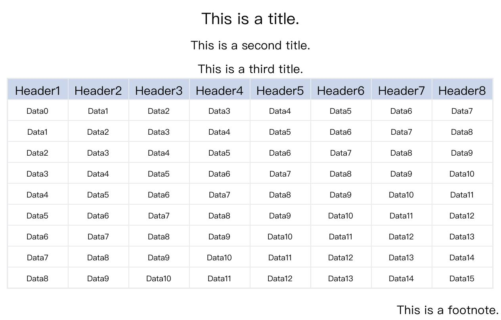

### Merge header cell
This package can also generate a table that has two rows for header or even more rows, and some some cells need to be merged. Let's see how to finish that.

Suppose I want to generate a table that has 2 rows for header, 8 columns, 8 data rows. So the table will be 10 rows * 8 columns, and the first row header only have
3 header text. Which means some cells will be merged. Assuming I want the first 2 cells to be merged, then merge 4 and 2 cells respectively among the remaining 6 cells.
So, there are 3+8=11 header texts, those texts will be assigned to the header_dict's key `content` as a list.

Then specify the merged dict, which tells how to merge the cells. In this example, the cell located at `(0,0), (0,2), (0,6)` needs merging. The cell `(0,0)` merge 1 column rightwards, the cell `(0,2)` merge 3 column rightwards, and the cell `(0,6)` merge 1 column rightwards. So the merged dict will be: `cell_merged_dict={'0-0':[0,1], '0-2':[0,3], '0-6':[0,1]}`.

> Note: `'0-0':[0.1]` means that the cell `(0,0)` will merge 0 row downwards, 1 column rightwards.

```python
import tablepic as tp

title_list = [{'content': 'This is a cell merged table'}]
# 11 header text
header_dict = {'content': ['MergedHead1', 'MergedHead2','MergedHead3'] + [f'Header{i+1}' for i in range(8)]}
# 8 * 8 data content
data_dict = {'content':[[f'Data{i+j}' for j in range(8)] for i in range(8)]}
# cell merged info
cell_merge_dict = {'0-0':[0,1], '0-2':[0,3], '0-6':[0,1]}
tp.generate_table_pic(10, 8, title_list=title_list, header_dict=header_dict,
                      data_dict=data_dict, img_path='./pic/merged_table1.jpg',
                      cell_merge_dict=cell_merge_dict)
```

The result will be:

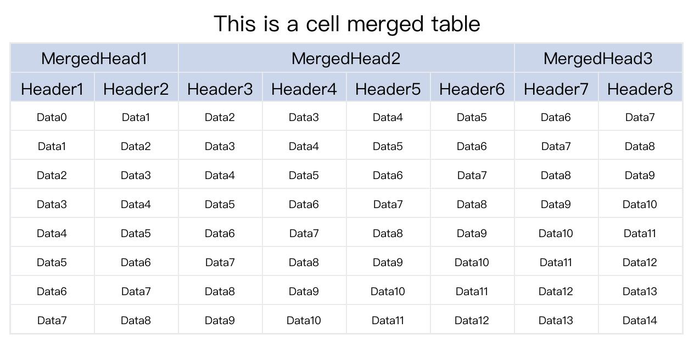

Let's try to merge both row and column. In the following example, the cell `(0,0)` will be merge 1 row downwards and 2 column rightwards. That means the 5 cells located at `(0,1), (0,2) (1,0), (1,1), (1,2)` will not exists. The cell `(0,3)` merge 1 column rightwards, and the cell `(0,6)` merge 1 row downwards. So there are 8 headers in total.

```python
import tablepic as tp

# merge row and column
title_list = [{'content': 'This is a cell merged table for row and column'}]
# 8 header text
header_dict = {'content': ['Merge row and column', 'MergedHead2','row\nmerged'] + [f'Header{i+1}' for i in range(5)]}
# 8 * 8 data content
data_dict = {'content':[[f'Data{i+j}' for j in range(8)] for i in range(8)]}
# cell merged info
cell_merge_dict = {'0-0':[1,2], '0-3':[0,2], '0-6':[1,0]}
tp.generate_table_pic(10, 8, title_list=title_list, header_dict=header_dict,
                      data_dict=data_dict, img_path='./pic/merged_table2.jpg',
                      cell_merge_dict=cell_merge_dict)
```

It is important that the order of the value fot the `content` key in the `header_dict`. The header will be output to the cell from left to right, and will skip the cells which are be merged.

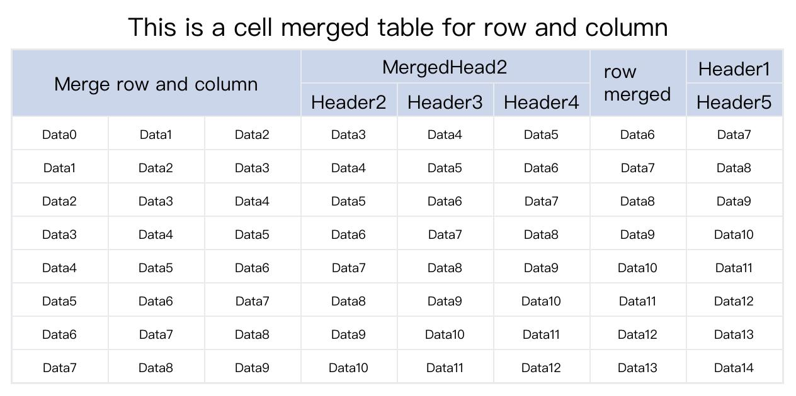


> The data cells can also be merged by the same way.

### Change width or height
The default width of the column is 150, and the default height of the row is 50. They be changed by parameters `cell_width, cell_height`.

```python
import tablepic as tp

# merge row and column
title_list = [{'content': 'This is a cell merged table and changed the size,'}]
# 8 header text
header_dict = {'content': ['Merge row and column', 'MergedHead2','row\nmerged'] + [f'Header{i+1}' for i in range(5)]}
# 8 * 8 data content
data_dict = {'content':[[f'Data{i+j}' for j in range(8)] for i in range(8)]}
# cell merged info
cell_merge_dict = {'0-0':[1,2], '0-3':[0,2], '0-6':[1,0]}
tp.generate_table_pic(10, 8, title_list=title_list, header_dict=header_dict,
                      data_dict=data_dict, img_path='./pic/change_size_table1.jpg',
                      cell_merge_dict=cell_merge_dict,
                      cell_width=200, cell_height=80)
```

The result:

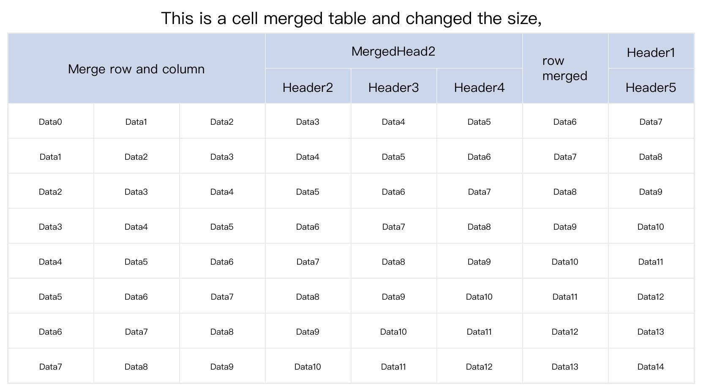


If you want to change the width of individual columns or the height of individual rows, you can use `col_width_dict, row_height_dict`. Let's see an example:

```python
import tablepic as tp

# merge row and column
title_list = [{'content': 'This is a cell merged table and changed the size,'}]
# 8 header text
header_dict = {'content': ['Merge row and column', 'MergedHead2','row merged'] + [f'Header{i+1}' for i in range(5)]}
# 8 * 8 data content
data_dict = {'content':[[f'Data{i+j}' for j in range(8)] for i in range(8)]}
# cell merged info
cell_merge_dict = {'0-0':[1,2], '0-3':[0,2], '0-6':[1,0]}
tp.generate_table_pic(10, 8, title_list=title_list, header_dict=header_dict,
                      data_dict=data_dict, img_path='./pic/change_size_table2.jpg',
                      cell_merge_dict=cell_merge_dict,
                      col_width_dict={6:300}, row_height_dict={5:80})
```

The width of 7th column is 300, other columns will be the default 150. The height of the 6th row is 80, other rows will be the default 50. Of course, you can change the default width or height by `cell_width, cell_height`.

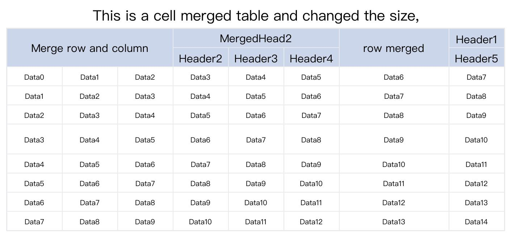


### Change the title style

The font, font-size, title color, alignment, title height can be changed. The element of the parameter `title_list` is a dict, it has the following valid key:
- content: required, the content of the title.
- font_size: optional, the font-size of the title, default value is 40 for the main title, and 30 for the subtitle.
- color: optional, the color of the title, default value is '#000000' which means white.
- align: optional, the alignment of the title, default value is 'center', other valid value is 'left', 'right'.
- height: optional, the height of the title, default value is 80 for the main title, and 60 for the subtitle.

> The main title means the first element of the `title_list`, others are subtitles.

Let's see an example.

```python
import tablepic as tp

# Modify the style of the title.
title_list = [{'content': 'This is a cell merged table', 'font_size': 80, 'color':'#EE00DD', 'height': 100},
    {'content': 'This is a subtitle', 'color':'#0000FF', 'align':'right'}]
# 11 header text
header_dict = {'content': ['MergedHead1', 'MergedHead2','MergedHead3'] + [f'Header{i+1}' for i in range(8)]}
# 8 * 8 data content
data_dict = {'content':[[f'Data{i+j}' for j in range(8)] for i in range(8)]}
# cell merged info
cell_merge_dict = {'0-0':[0,1], '0-2':[0,3], '0-6':[0,1]}
tp.generate_table_pic(10, 8, title_list=title_list, header_dict=header_dict,
                      data_dict=data_dict, img_path='./pic/title_style_table.jpg',
                      cell_merge_dict=cell_merge_dict)
```

The results:

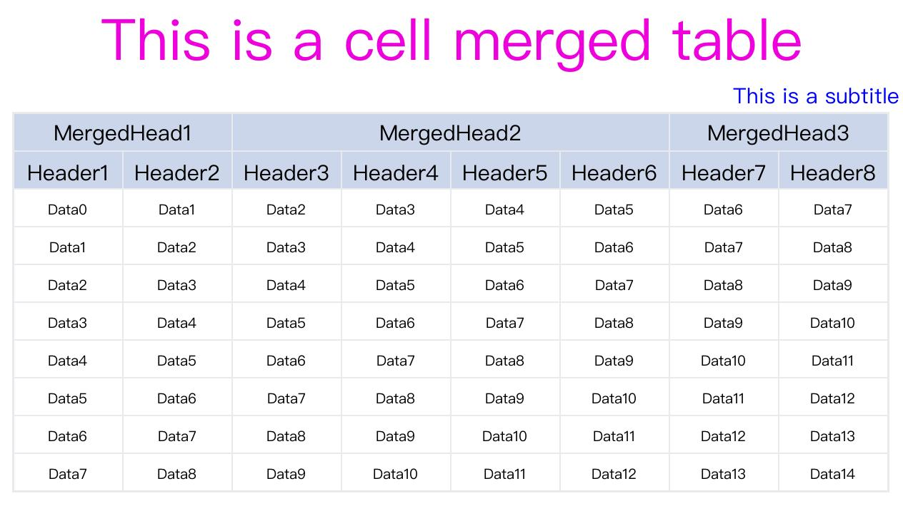

### Change the header style

The parameter `header_dict` also has another keys to modify the header style. The valid keys:
- content: required, list, the header content.
- font_size: optional, int or dict, the font size of headers. If an int value is assigned, it sets the font size of all headers to the assigned value. By using a dict, you can set different font sizes for different headers. The default font-size is 30.
- bk_color: optional, str or dict, the background color of the header cell. If a str value is assigned, it sets the background color of all headers to the assigned value. By using a dict, you can set different background color for different headers. The default value is '#CCD6EB'.
- fore_color: optional, str or dict, the text color of headers, same as bk_color. The default value is '#000000' (black).
- align: optional, str or dict, the alignment of headers, same as bk_color. The default valye is 'center', other valid value is 'left', 'right'.

When assign a dict to `font_size, bk_color, fore_color, align`, the key is the index of the header content. Let's see an example.

```python
import tablepic as tp

title_list = [{'content': 'This is a cell merged table'}]
# Modify the header style.
header_dict = {'content': ['MergedHead1', 'MergedHead2','MergedHead3'] + [f'Header{i+1}' for i in range(8)],
    'font_size': {1: 45},
    'bk_color': '#BADC58',
    'align': {0:'left', 2:'right'},
    'fore_color': {0:'#B71540', 1: '#6F1E51', 2:'#546DE5'}}
# 8 * 8 data content
data_dict = {'content':[[f'Data{i+j}' for j in range(8)] for i in range(8)]}
# cell merged info
cell_merge_dict = {'0-0':[0,1], '0-2':[0,3], '0-6':[0,1]}
tp.generate_table_pic(10, 8, title_list=title_list, header_dict=header_dict,
                      data_dict=data_dict, img_path='./pic/header_style_table.jpg',
                      cell_merge_dict=cell_merge_dict)
```

The results:

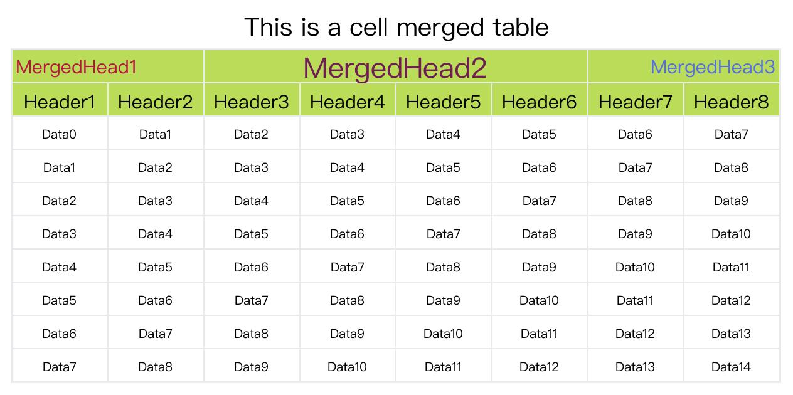

### change the data style

The parameter `data_dict` has the following valid key:
- content: required, two-dimensional list, the data content.
- font_size: optional, int or dict, the font size of data. If an int value is assigned, it sets the font size of all data cell to the assigned value. By using a dict, you can set different font sizes for different data cell. The default font-size is 20.
- bk_color: optional, str or dict, the background color of the data cell. If a str value is assigned, it sets the background color of all data cells to the assigned value. By using a dict, you can set different background color for different data cell. The default value is '#FFFFFF'.
- fore_color: optional, str or dict, the text color of data cells, same as bk_color. The default value is '#000000' (black).
- align: optional, str or dict, the alignment of data cells, same as bk_color. The default valye is 'center', other valid value is 'left', 'right'.

When assign a dict to `font_size, bk_color, fore_color, align`, the key has 3 type:
- row index: `r0` means the first data row, the style will applied to the entire row.
- column index: `c2` means the third data column, the style will applied to the entire column.
- cell coordinate: `2-3` means the cell located at third row, forth column, the style only applied to the cell.

Let's see an example:

```python
import tablepic as tp

title_list = [{'content': 'This is a cell merged table'}]
# Modify the header style.
header_dict = {'content': ['MergedHead1', 'MergedHead2','MergedHead3'] + [f'Header{i+1}' for i in range(8)]}
# 8 * 8 data content
data_dict = {'content':[[f'Data{i+j}' for j in range(8)] for i in range(8)],
    'font_size': 20,
    'bk_color': {'r0': '#78E08F'},
    'fore_color': {'c3': '#EB3B5A'},
    'align': {'3-5': 'right'}
    }
# cell merged info
cell_merge_dict = {'0-0':[0,1], '0-2':[0,3], '0-6':[0,1]}
tp.generate_table_pic(10, 8, title_list=title_list, header_dict=header_dict,
                      data_dict=data_dict, img_path='./pic/data_style_table.jpg',
                      cell_merge_dict=cell_merge_dict)
```

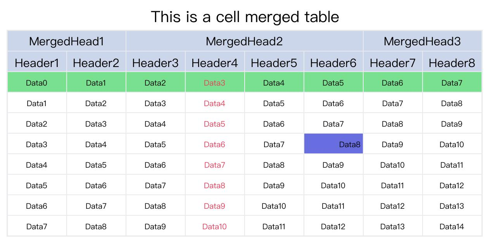


### Change the font

For now, the font of title, header, data can not be set individualy. The font will applied to all texts.

```python
import tablepic as tp

# Change Font
font_path = 'Users/xinyan/Library/Fonts/sarasa-mono-sc-regular.ttf'
title_list = [{'content': 'This is a cell merged table'}]
# Modify the header style.
header_dict = {'content': ['MergedHead1', 'MergedHead2','MergedHead3'] + [f'Header{i+1}' for i in range(8)]}
# 8 * 8 data content
data_dict = {'content':[[f'Data{i+j}' for j in range(8)] for i in range(8)],
    'font_size': 20,
    'bk_color': {'r0': '#78E08F', '3-5': '#686DE0'},
    'fore_color': {'c3': '#EB3B5A'},
    'align': {'3-5': 'right'}
    }
# cell merged info
cell_merge_dict = {'0-0':[0,1], '0-2':[0,3], '0-6':[0,1]}
tp.generate_table_pic(10, 8, title_list=title_list, header_dict=header_dict,
                      data_dict=data_dict, img_path='./pic/font_style_table.jpg',
                      font_path=font_path,
                      cell_merge_dict=cell_merge_dict)
```

The result:


### Change background color and table line color

The background of the picture can be changed by the parameter `pic_bk_color`, and the table line color can be changed by the parameter `table_line_color`. Let's see an example:


```python
import tablepic as tp

title_list = [{'content': 'This is a cell merged table'}]
# Modify the header style.
header_dict = {'content': ['MergedHead1', 'MergedHead2','MergedHead3'] + [f'Header{i+1}' for i in range(8)]}
# 8 * 8 data content
data_dict = {'content':[[f'Data{i+j}' for j in range(8)] for i in range(8)],
    'font_size': 20,
    'bk_color': {'r0': '#78E08F', '3-5': '#686DE0'},
    'fore_color': {'c3': '#EB3B5A'},
    'align': {'3-5': 'right'}
    }
# cell merged info
cell_merge_dict = {'0-0':[0,1], '0-2':[0,3], '0-6':[0,1]}
tp.generate_table_pic(10, 8, title_list=title_list, header_dict=header_dict,
                      data_dict=data_dict, img_path='./pic/bk_style_table.jpg',
                      font_path=font_path,
                      cell_merge_dict=cell_merge_dict,
                      pic_bk_color='#DFE4EA',
                      table_line_color='#2F3542')
```


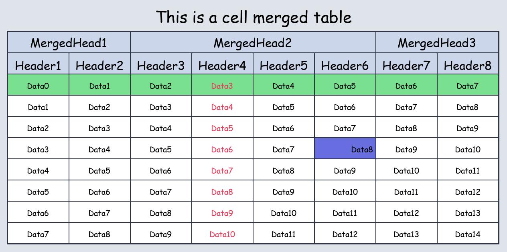

# What's Next

The data cell can not be merged, because the data content is passed by a 2-dimentional list.

# LICENSE

Please refer to [LICENSE](LICENSE) file.