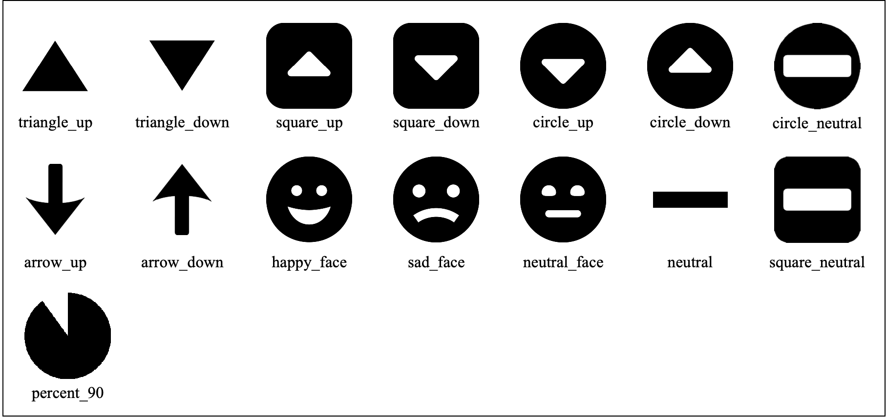
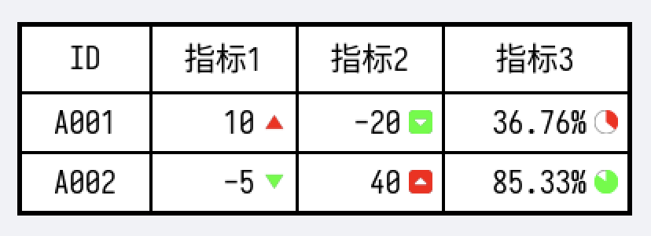
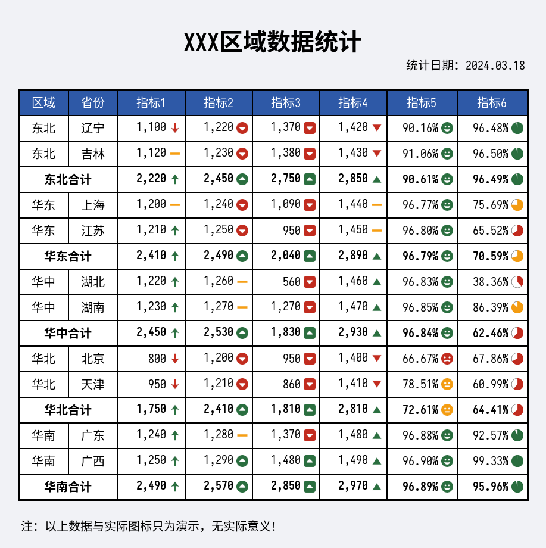
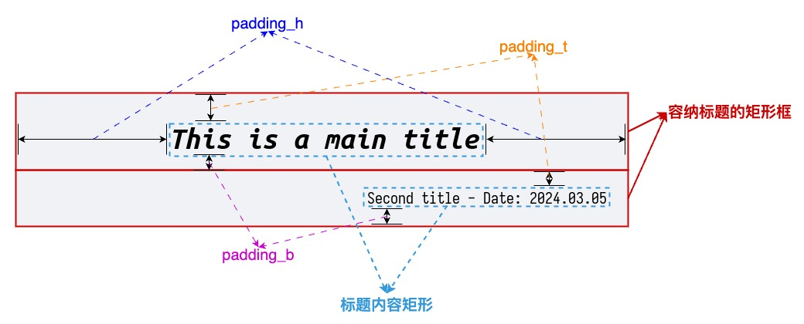

<!--
 * @Author: xinyan
 * @Date: 2023-11-02 19:07:09
 * @LastEditors: xinyan
 * @LastEditTime: 2024-03-24 19:45:54
 * @Description: file content
-->

# TablePic

- [TablePic](#tablepic)
  - [1. 概述](#1-概述)
  - [2. 安装](#2-安装)
  - [3. 版本说明](#3-版本说明)
    - [v0.2.2](#v022)
      - [更新概览](#更新概览)
      - [索引支持详述](#索引支持详述)
      - [表格内容支持二维列表](#表格内容支持二维列表)
      - [图标支持](#图标支持)
      - [完成示例代码](#完成示例代码)
    - [v0.2.1](#v021)
    - [v0.2.0](#v020)
    - [v0.1.0](#v010)
    - [v0.0.9](#v009)
    - [v0.0.8](#v008)
      - [已有图片的合并](#已有图片的合并)
      - [生成图片在合并](#生成图片在合并)
    - [v0.0.4](#v004)
  - [4. v0.2.0新版本使用说明](#4-v020新版本使用说明)
    - [4.1.1. 标题部分结构及定义](#411-标题部分结构及定义)
    - [4.1.2. 脚注部分结构及定义](#412-脚注部分结构及定义)
    - [4.1.2. 表格部分结构及定义](#412-表格部分结构及定义)
  - [5. v0.1.0版本前的使用说明](#5-v010版本前的使用说明)
    - [基础表格](#基础表格)
    - [合并表头单元格](#合并表头单元格)
    - [修改宽度和高度](#修改宽度和高度)
    - [修改标题样式](#修改标题样式)
    - [修改表头样式](#修改表头样式)
    - [修改数据内容样式](#修改数据内容样式)
    - [修改字体](#修改字体)
    - [修改背景颜色和表格线的颜色](#修改背景颜色和表格线的颜色)
- [许可](#许可)


## 1. 概述
这个包使用PIL（pillow）来生成包含表格的图片。它具有类似于matplotlib的table的功能，但包括更多的自定义选项。

## 2. 安装

请使用pip来安装这个包。

```shell
pip install tablepic
```

## 3. 版本说明

### v0.2.2

#### 更新概览
- 更新日期：2024.03.22
- 更新内容：针对函数 `complex_table_pic` 进行了功能优化，以及数据图表的支持。具体包括：
  - 1、参数 `cell_dict` 在指定行、列、单元格时支持逆向索引；单元格的索引还支持行列坐标索引。
  - 2、参数 `cell_dict` 的key `content` 的值支持二维列表输入；要求每行的列数是相同的。
  - 3、支持对单元格添加指示性的图标：箭头、表情、百分比。

#### 索引支持详述
针对一个5x5，且没有单元格合并的表格，除了用 `r0` 表示第一行外，还可以用 `r-5`表示相同的行；可以用 `c2` 和 `c-3` 表示相同的列。

在此版本之前，单元格的索引与 `content` 参数内容的索引同步。若要对第二行第一列的单元格设置属性，则必须通过索引`5` 表示。在此版本后，还可以通过 `1-0`、`1,0`、`1,-5` 、`-4,0`、`-4,-5` 表示。

> 注：在一开始设计此包时，单元格索引使用 `[行坐标]-[纵坐标]` 的方式，“-”作为分隔符使用。但是此次增加逆向索引的功能时发现，逆向索引的负号会和分隔符混在一起。所以，此次增加了“,”作为分隔符的支持。若要使用逆向索引，必须使用逗号分隔符。

代码示例：

```python
bold_font_path = '/xxx/xxx.ttf

cell_dict = {
    'content': [
        'xxx','xxx','xxx','xxx',
        'xxx','xxx','xxx','xxx',
        'xxx','xxx','xxx','xxx'
    ],
    'font_path': {'r0': bold_font_path, 'r-1': bold_font_path}
    'back_color': {'r3': '#FF0000', 'c-1': '00FF00'}
    'font_size': {4: 20, '1-0': 25, '2,2': 30, '-1,-1': 40}
}
```

#### 表格内容支持二维列表

为了更加方便使用，增加二维列表的赋值方式。但需要注意
- 如果是一维列表赋值，被合并的单元格内容是不需要指定的。
- 如果是二维列表赋值，被合并的单元格的内容也需要指定（虽然不使用），也就意味着1维列表的大小必须相同。

代码示例：

```python

# 假设3*4的表格，有第三行的前个单元格被合并
merge_dict = {'2,0':[0,1]}
# 一维列表赋值
cell_dict = {
    'content': [
        'xxx','xxx','xxx','xxx',
        'xxx','xxx','xxx','xxx',
        'xxx','xxx','xxx'
    ],
}

# 二维列表赋值
cell_dict = {
    'content': [
        ['xxx','xxx','xxx','xxx'],
        ['xxx','xxx','xxx','xxx'],
        ['xxx','占位没用','xxx','xxx']
    ],
}
```
#### 图标支持

此版本增加了单元格指示性图标的支持，目前可使用的图标类型包括以下几种：



图标的设定只支持单元格，也就是说需要为想要设定图标的单元格都分别指定。通过 `cell_dict` 参数中的 `icon_config` key来为每个单元格设定图标属性。目前可以指定：
- 图标的类型
- 图标的颜色

图标的类型即为上图中每个图标下方的名字，颜色通过十六进制颜色代码指定，两部分信息通过“@”进行分割。其中百分比图标可以指定具体的百分比数。

示例代码：

```python
cell_dict = {
    'content': [
        ['ID', '指标1', '指标2', '指标3'],
        ['A001', '10', '-20', '36.76%'],
        ['A002', '-5', '40', '85.33%'],
    ],
    'icon_config': {
        '1,1': 'triangle_up@#FF0000', '1,2': 'square_down@#00FF00', '1,3': 'percent_36@#FF0000',
        '2,1': 'triangle_down@#00FF00', '2,2': 'square_up@#FF0000', '2,3': 'percent_85@#00FF00',
    }
}
```

以上设置将会得到下面的结果：




#### 完成示例代码

以下是一段完整的代码，生成的结果如下所示：



```python

import pandas as pd
import tablepic as tp

data_list = [
    ['华北', '北京', 800, 1200, 950, 1400],
    ['华北', '天津', 950, 1210, 860, 1410],
    ['东北', '辽宁', 1100, 1220, 1370, 1420],
    ['东北', '吉林', 1120, 1230, 1380, 1430],
    ['华东', '上海', 1200, 1240, 1090, 1440],
    ['华东', '江苏', 1210, 1250, 950, 1450],
    ['华中', '湖北', 1220, 1260, 560, 1460],
    ['华中', '湖南', 1230, 1270, 1270, 1470],
    ['华南', '广东', 1240, 1280, 1370, 1480],
    ['华南', '广西', 1250, 1290, 1480, 1490],
]

df = pd.DataFrame(data_list, columns=['区域', '省份', '指标1', '指标2', '指标3', '指标4'])
df_sum = df.groupby('区域').sum(numeric_only=True).reset_index()
df_sum['区域'] = df_sum['区域'].apply(lambda x: x+'合计')
df_sum['省份'] = ''

df_final = pd.concat([df, df_sum], axis=0).sort_values(by='区域').reset_index(drop=True)
df_final['指标5'] = df_final['指标1'] / df_final['指标2']
df_final['指标6'] = df_final['指标3'] / df_final['指标4']

# 类型处理
for col in ['指标1', '指标2', '指标3', '指标4']:
    df_final[col] = df_final[col].apply(lambda x: f'{x:,}')
for col in ['指标5', '指标6']:
    df_final[col] = df_final[col].apply(lambda x: f'{x:.2%}')


font_path = '/Users/xinyan/Library/Fonts/sarasa-mono-sc-regular.ttf'
font_bold_path = '/Users/xinyan/Library/Fonts/sarasa-mono-sc-bold.ttf'
title_list = [
    {'content': 'XXX区域数据统计', 'padding_b': 0, 'font_path': font_bold_path},
    {'content': '统计日期：2024.03.18', 'font_size': 20, 'align': 'right', 'padding_t':10, 'padding_b':0, 'x_offset': -30},
]

footnote_list = [
    {'content': '注：以上数据与实际图标只为演示，无实际意义！', 'padding_t': 0},
]

# 单元格内容
content_list = [df_final.columns.tolist()] + df_final.values.tolist()
# 合并单元格计算：合计行的【区域】字段合并
merge_dict = {}
row_font_path = {}
for idx, val in enumerate(df_final['区域']):
    if val.endswith('合计'):
        merge_dict[f'{idx+1}-0'] = [0, 1]
        row_font_path[f'r{idx+1}'] = font_bold_path
# 颜色定义
clr_good = '#2a6e3f'
clr_warn = '#f39c12'
clr_bad = '#c12c1f'
# 图标配置
icon_config = {}
for r_idx, row in df_final.iterrows():
    c_idx = 0
    for col, val in row.items():
        # 指标1：箭头
        if col == '指标1':
            if float(val.replace(',', '')) > 1200:
                icon_config[f'{r_idx+1}-{c_idx}'] = f'arrow_up@{clr_good}'
            elif float(val.replace(',', '')) > 1100:
                icon_config[f'{r_idx+1}-{c_idx}'] = f'neutral@{clr_warn}'
            else:
                icon_config[f'{r_idx+1}-{c_idx}'] = f'arrow_down@{clr_bad}'
        # 指标2：圆圈箭头
        elif col == '指标2':
            if float(val.replace(',', '')) > 1280:
                icon_config[f'{r_idx+1}-{c_idx}'] = f'circle_up@{clr_good}'
            elif float(val.replace(',', '')) > 1250:
                icon_config[f'{r_idx+1}-{c_idx}'] = f'neutral@{clr_warn}'
            else:
                icon_config[f'{r_idx+1}-{c_idx}'] = f'circle_down@{clr_bad}'
        # 指标3：方块箭头
        elif col == '指标3':
            if float(val.replace(',', '')) > 1400:
                icon_config[f'{r_idx+1}-{c_idx}'] = f'square_up@{clr_good}'
            elif float(val.replace(',', '')) > 1380:
                icon_config[f'{r_idx+1}-{c_idx}'] = f'neutral@{clr_warn}'
            else:
                icon_config[f'{r_idx+1}-{c_idx}'] = f'square_down@{clr_bad}'
        # 指标4：三角箭头
        elif col == '指标4':
            if float(val.replace(',', '')) > 1450:
                icon_config[f'{r_idx+1}-{c_idx}'] = f'triangle_up@{clr_good}'
            elif float(val.replace(',', '')) > 1430:
                icon_config[f'{r_idx+1}-{c_idx}'] = f'neutral@{clr_warn}'
            else:
                icon_config[f'{r_idx+1}-{c_idx}'] = f'triangle_down@{clr_bad}'
        # 指标5：表情
        elif col == '指标5':
            if float(val.replace('%', '')) > 90:
                icon_config[f'{r_idx+1}-{c_idx}'] = f'happy_face@{clr_good}'
            elif float(val.replace('%', '')) > 70:
                icon_config[f'{r_idx+1}-{c_idx}'] = f'neutral_face@{clr_warn}'
            else:
                icon_config[f'{r_idx+1}-{c_idx}'] = f'sad_face@{clr_bad}'
        # 指标6：百分比
        elif col == '指标6':
            if float(val.replace('%', '')) > 90:
                icon_config[f'{r_idx+1}-{c_idx}'] = f"percent_{float(val.replace('%', ''))}@{clr_good}"
            elif float(val.replace('%', '')) > 70:
                icon_config[f'{r_idx+1}-{c_idx}'] = f"percent_{float(val.replace('%', ''))}@{clr_warn}"
            else:
                icon_config[f'{r_idx+1}-{c_idx}'] = f"percent_{float(val.replace('%', ''))}@{clr_bad}"
        c_idx += 1

cell_dict = {
    'content': content_list,
    'back_color': {'r0': '#2e59a7'},
    'fore_color': {'r0': '#FFFFFF'},
    'font_path': row_font_path,
    'icon_config': icon_config,
}
img_path = './pic/demo_complex_table_with_icon.png'
tp.complex_table_pic(df_final.shape[0]+1, df_final.shape[1], title_list, cell_dict, font_path, img_path,
    footnote_list=footnote_list, cell_merge_dict=merge_dict)

```


### v0.2.1
- 更新日期：2024.03.17
- 更新内容：在函数 `complex_table_pic` 的参数 `cell_dict` 中针对单元格内容的属性设置上增加一种索引方式。

在 v0.2.0 版本中，在给 `cell_dict` 赋值时若要给指定的某个单元格进行个性化属性设置时，需根据单元格的顺序索引进行指定。
在以下代码中若要针对单元格内容“Content2”进行单元格背景颜色，以及字体的单独设置，则是通过该值在 `cell_dict['content']` 列表中的索引，即 `4` 来指定。如下所示：

```python
import tablepic as tp

font_path = '/Users/xinyan/Library/Fonts/sarasa-mono-sc-regular.ttf'
font_bold_path = '/Users/xinyan/Library/Fonts/UbuntuMono-BI.ttf'
title_list = [
    {'content': 'This is a main title', 'padding_b': 0, 'font_path': font_bold_path}
]

cell_dict = {
    'content': ['Header1', 'Header2', 'Header3',
        'Content1', 'Content2', 'Content3',
        'Content4', 'Content5', 'Content6',
    ],
    'back_color': {4: '#FF0000'},
    'font_path': {4: font_bold_path},
}
img_path = './pic/demo_table.jpg'
tp.complex_table_pic(5, 4, title_list, cell_dict, font_path, img_path, footnote_list)
```

在一些情况下，通过单元格在表格的坐标索引指定属性会更加方便。例如，“Content2”是表格中的第二行第二列，坐标索引是 `1-1`。在 v0.2.1 版本中增加此种方式的索引指定。也可以通过如下代码实现相同的效果：

```python

cell_dict = {
    'content': ['Header1', 'Header2', 'Header3',
        'Content1', 'Content2', 'Content3',
        'Content4', 'Content5', 'Content6',
    ],
    'back_color': {'1-1': '#FF0000'},
    'font_path': {'1-1': font_bold_path},
}

```


### v0.2.0
大版本更新：重新设计生成表格图片的逻辑，对核心代码进行重写。为了不影响已有函数的功能受影响，此次更新新增一个函数 `complex_table_pic` 来实现更加复杂的表格。相比之前的 `generate_table_pic` 函数，主要有以下几个方面的优化：
1. 表格不在区分表头部分、数据部分，都统一为单元格。主要目的是实现所有单元格可自由合并；（旧版本只支持表头单元格合并）
2. 标题、脚注、表格可分别设置不同的字体、大小、颜色、间距等；其中表格可支持到每个单元格的设置；（旧版本所有内容都只能使用相同的字体）
3. 针对单元格中内容存在换行符的情况进行优化，多行文本能够同时自动居中；（旧版本需要手动对多行中的短文本增加空格来实现同时居中）
4. 标题、脚注、表格之间的间距高度自定义；（旧版本并不能做很精细的控制）

新版本可实现的效果如下：


详细的使用说明简下一章节。


### v0.1.0
bug修复。


### v0.0.9
在之前的版本中，如果标题比表格内容还宽，会出现标题被截断的情况：


在v0.0.9中修复此bug:


代码：
```python
# Before version v0.0.9
title_list = [{'content': 'This is a long tile, which is longer than the table'}]
header_dict = {'content': [f'Header{i+1}' for i in range(5)]}
data_dict = {'content':[[f'Data{i+j}' for j in range(5)] for i in range(5)]}
tp.generate_table_pic(6, 5, title_list=title_list, header_dict=header_dict,
                      data_dict=data_dict, img_path='./pic/long_title_table1.jpg')


# After version v0.0.9
title_list = [{'content': 'This is a long tile, which is longer than the table'}]
header_dict = {'content': [f'Header{i+1}' for i in range(5)]}
data_dict = {'content':[[f'Data{i+j}' for j in range(5)] for i in range(5)]}
tp.generate_table_pic(6, 5, title_list=title_list, header_dict=header_dict,
                      data_dict=data_dict, img_path='./pic/long_title_table2.jpg')
```


### v0.0.8
v0.0.4-v0.0.7之间进行了一些bug的修复，无太多功能性的修改。

v0.0.8版新增加图片合并的功能，用于将生成的多个表格图片合并到一张图里面。函数参数如下：

combine_multiple_pic
- combine_path: str, 合并后图片的路径
- path_list: list[str], 需要合并的图片的路径列表
- img_list: list[Image]，需要合并的图片对象列表（PIL中的Image对象，可以使用函数 generate_table_pic() 生成返回，也可以自定义生成）
- pic_bk_color: 生成图片的背景色，默认白色。

#### 已有图片的合并
使用示例如下：

```python
import tablepic as tp

pic_path_list = ['/tmp/pic1.png', '/tmp/pic2.png']
combine_path = '/tmp/combine_table.png'
tp.combine_multiple_pic(combine_path, pic_path_list)
```

生成结果如下：


#### 生成图片在合并
使用示例如下：

```python
import tablepic as tp

# pic1
title_list = [{'content': 'This is table 1'}]
header_dict = {'content': [f'Header{i+1}' for i in range(8)]}
data_dict = {'content':[[f'Data{i+j}' for j in range(8)] for i in range(9)]}
img1 = tp.generate_table_pic(10, 8, title_list=title_list, header_dict=header_dict, data_dict=data_dict)

# pic2
title_list = [{'content': 'This is table 2'}]
header_dict = {'content': [f'Header{i+1}' for i in range(5)]}
data_dict = {'content':[[f'Data{i+j}' for j in range(5)] for i in range(9)]}
img2 = tp.generate_table_pic(10, 5, title_list=title_list, header_dict=header_dict, data_dict=data_dict)

combine_path = './pic/combine_table.jpg'
tp.combine_multiple_pic(combine_path, img_list=[img1, img2])
```

生成结果如下：


### v0.0.4
在之前的版本中，所有列的默认宽度相同且固定。如果表格中内容的长度过长，会导致内容重叠，并且表格无法根据内容调整宽度。在v0.0.4版本中，添加了对表格内容宽度和高度的识别，自动为每个列和行设置适当的高度。

v0.0.4版本的结果：


在v0.0.3版本及之前的结果：


## 4. v0.2.0新版本使用说明

重构后的新版本将图片的构成完全拆解为独立的三部分，可以自由组合这三部分内容。


程序会基于给定标题内容、表格内容、脚注内容计算三个大的矩形框大小，然后取三个矩形框最大的宽度作为最终图片的总宽度，累加三个矩形框的高度作为图片最终的高度。然后再基于图片最终的的宽度和高度，分别调整每部分的起始坐标，进而输出每部分的内容。

`complex_table_pic` 函数的参数如下：
- row_num:int, 必选参数，指定表格的总行数
- col_num:int, 必选参数，指定表格的总列数
- title_list:list[dict], 必选参数，指定标题内容及设置
- cell_dict:dict, 必选参数，指定表格的内容及设置
- font_path:str, 必选参数，指定全局的字体文件路径
- img_path:str=None, 可选参数，指定图片的生成路径；若不指定，则返回Image对象，可用于 `combine_multiple_pic` 函数，将多个图片合并
- footnote_list:list[dict], 可选参数，指定脚注内容及设置
- col_width_dict:dict, 可选参数，自定义列的宽度；默认会根据内容及字体大小自动计算
- row_height_dict:dict, 可选参数，自定义行的高度；默认会根据内容及字体大小自动计算
- cell_merge_dict:dict, 可选参数，指定合并的单元格信息
- table_padding:int=30, 可选参数，指定表格上、下、左、右四边的间距大小，默认30
- table_line_width:int=3, 可选参数，指定表格线的宽度，默认3
- table_line_color:str='#000000', 可选参数，指定表格线条的颜色
- pic_bk_color:str='#F1F2F6', 可选参数，指定图片的背景色，默认为浅灰色('#F1F2F6')


### 4.1.1. 标题部分结构及定义

标题通过参数 `title_list` 定义，可以指定多个标题，每个标题是一个字典。可以使用的key包括:
- content: 必选key，指定当前标题的文字内容
- font_path: 可选key，指定当前标题的字体文件，默认取函数参数指定的字体文件
- font_size: 可选key，指定当前标题的字体大小，默认为40
- color: 可选key，指定当前标题文字的颜色，默认为黑色
- align: 可选key，指定当前标题的对齐方式，默认为'center'；其他取值：'left', 'right'
- padding_t: 可选key，指定标题的文字垂直方向上方间距大小，默认为50
- padding_b: 可选key，指定标题文字垂直方向下方的间距大小，默认为10
- padding_h: 可选key，指定标题水平方向单侧的间距大小（左右两侧间距大小相等），默认为80
- x_offset: 可选key，指定标题文字输出时x轴的偏移量，默认为0；正数向右移动，负数向左移动

标题的布局构成如下所示：



> 注：考虑到标题下方可以是其他标题，或者表格，而这两者都有上方的间距，为了不留过多的空白，所以把标题下方的默认间距设置的比较小。

`title_list` 赋值示例：

```python

title_list = [
    {'content': 'This is a main title'},
    {'content': 'Second title - Date: 2024.03.05'},
]

font_bold_path = '/User/xxx/xxx-bold.ttf'
title_list = [
    {'content': 'This is a main title', 'padding_b': 0, 'font_path': font_bold_path},
    {'content': 'Second title - Date: 2024.03.05', 'font_size': 20, 'align': 'right', 'x_offset': -30},
]

```

> 注：标题中设定的 `padding_h` 仅仅是用来结合标题内容确定图片最终的宽度，并不是标题最终真正的水平间距，而是一个最小的间距。
> 
> 例如：假设标题文本宽度为`300`，设置水平间距为`60`，则标题的最大宽度为`300+60*2=420`；假设表格部分的最大宽度是`500`，在不考虑脚注的前提下，则图片最终的宽度就是`500`。那么最终标题单侧的水平间距就是 `500-300/2=100`。

### 4.1.2. 脚注部分结构及定义

脚注通过参数 `footnote_list` 定义，其构成与用法与 `title_list` 基本没有区别。仅有部分key的默认值不同，其他特性跟标题一模一样。
- content: 必选key，指定当前脚注的文字内容
- font_path: 可选key，指定当前脚注的字体文件，默认取函数参数指定的字体文件
- font_size: 可选key，指定当前脚注的字体大小，默认为20
- color: 可选key，指定当前脚注文字的颜色，默认为黑色
- align: 可选key，指定当前脚注的对齐方式，默认为'left'；其他取值：'center', 'right'
- padding_t: 可选key，指定标题脚注字垂直方向上方间距大小，默认为10
- padding_b: 可选key，指定标题脚注垂直方向下方的间距大小，默认为30
- padding_h: 可选key，指定标题脚注方向单侧的间距大小（左右两侧间距大小相等），默认为50
- x_offset: 可选key，指定标题脚注输出时x轴的偏移量，默认为0；正数向右移动，负数向左移动

有关用法，及注意事项参见标题部分。

### 4.1.2. 表格部分结构及定义

表格部分通过三个核心的必选参数进行定义：
- row_num: int类型, 指定表格的总行数
- col_num: int类型, 指定表格的总列数
- cell_dict: dict类型, 指定表格的内容及设置

前两个参数很好理解不用过多说明，`cell_dict`的赋值方式较多，下文单独介绍。此外，还包括6个可选的参数：
- col_width_dict: dict类型, 自定义列的宽度；默认会根据内容及字体大小自动计算
- row_height_dict: dict类型, 自定义行的高度；默认会根据内容及字体大小自动计算
- cell_merge_dict: dict类型, 指定合并的单元格信息
- table_padding: int或者dict类型, 指定表格上、下、左、右四边的间距大小，默认30
- table_line_width: int类型, 可选参数，指定表格线的宽度，默认3
- table_line_color: str类型, 可选参数，指定表格线条的颜色（'#000000'）

其中 `col_width_dict` 和 `row_height_dict` 的key分别是列、行的索引，value分别为列宽和行高的大小。若想要设定第5列的宽度和第3行的高度，则按照以下方式进行设置：`col_width_dict={4: 200}, row_height_dict={2: 80}` 。

`cell_merge_dict` 用于指定合并的单元格信息，例如要位于第2行的第3、4列共两个单元格合并，则设置为：`cell_merge_dict={'1-2':[0, 1]}`；key为要合并的单元格坐标索引，value为数组，第一个元素为向下合并多少行，第二个元素为向右合并多少列。再比如：将位于第3、4行，第5、6列共四个单元格合并，则设置为：`cell_merge_dict={'2-4':[1, 1]}`。单元格索引坐标可参加下文图中的橙色坐标。

`table_padding` 用于指定表格外边框上、下、左、右四边的间距大小。当赋值为整数时，四边的间距是指定的值；也可以通过赋值字典，分别指定水平方向的间距，以及垂直方向上的上边距以及下边距。示例如下：

```python
# 指定四边的间距都为50
table_padding=50
# 指定水平方向上单侧的间距为40，上间距为20；此时，下间距为默认的30
table_padding={'padding_h': 40, 'padding_t': 20}
# 指定下间距为10，上间距为20；此时，左右两侧的间距为默认的30
table_padding={'padding_h': 20, 'padding_b':10}
```

`table_line_width` 和 `table_line_color` 参数比较简单，不过多赘述。目前，暂不支持个性化设置线的宽度，`table_line_width` 目前只能指定所有表格的线宽。

---

接下来，就是最重要的 `cell_dict` 参数。该参数通过字典指定表格每个单元格的具体内容以及属性。

首先是必选的key：
- content:list[str], 指定表格所有单元格的文本内容，即使是数字也需要以字符类型传递。给定的字符列表将按照从左到右，从上到下的方式依次填充每个单元格（如果有被合并的单元格则会跳过）。

例如：`cell_dict={'content': ['Content1', 'Content2', 'Content3', 'Content4']}` 指定了4个单元格内容，从左到右，从上到下填充2*2的表格。

接下来是三个针对表格内容的整体属性key：
- newline_margin_rate: float, 如果指定的单元格内容中存在换行符时，行间距为行内容高度的占比，默认为20%；
- pading_h:int， 单元格内容与左右边框的间距（设置单侧间距为多少），参见下文图中的“cell_padding_h”，默认为20；
- pading_v:int， 单元格内容与上下边框的间距（设置单侧间距为多少），参见下文图中的“cell_padding_v”，默认为10；

下面的属性key，可以按 单元格、列、行、所有单元格的方式设定：
- font_path: 文字内容的字体路径，默认为参数 `font_path` 的值；
- font_size: 文字内容的字体大小，默认为20；
- back_color: 单元格背景色，默认为白色；
- fore_color: 文字内容颜色，默认为黑色；
- align_h: 文字内容的水平对齐方式，默认为`center`，还可以设定`left`, `right`；
- align_v: 文字内容的垂直对齐方式，默认为`center`，还可以设定`left`, `right`；

以上6个key如果直接指定值则会对所有单元格生效，若想要指定某一列，或者某一行，或者某个具体的单元格，则需要通过字典的形式指定。
- 按行指定时字典的key为 `r[行索引]`，第一行为`r0`，第二行为`r1`，以此类推；
- 按列指定时字典的key为 `c[列索引]`，第一例为`c0`，第二列为`c1`，以此类推；
- 按单元格指定时字典的key为单元格的顺序索引，跟`content`指定的列表内容的索引一致，第5个单元格为 `4`，以此类推；

表格中行、列、单元格的坐标索引方式见下文说明。示例如下：

```python
# 指定第1行的背景色为红色
cell_dict = {'content': ['xx','xx','xx','xx'] 'back_color': {'r0': '#FF0000'}}

# 指定第3行使用其他的字体，且大小为30；指定第4行第5列的单元格背景色为红色，第11个单元格内容左对齐
new_font_path = '/User/xxx/xxx.ttf'
cell_dict = {
    'content': ['xx','xx','xx','xx'],
    'font_path': {'r2': new_font_path},
    'back_color': {10: '#FF0000'},
    'align_h': {'c0': 'left'}
}
```

表格行、列的索引，单元格的坐标索引方式见下图：


表格间距的说明：


## 5. v0.1.0版本前的使用说明

### 基础表格

以下代码生成一个基本的表格图片，包含一个标题和一个10行8列的常规表格。表格有1行表头和9行数据。

```python
import tablepic as tp

title_list = [{'content': 'This is a title.'}]
header_dict = {'content': [f'Header{i+1}' for i in range(8)]}
data_dict = {'content':[[f'Data{i+j}' for j in range(8)] for i in range(9)]}

tp.generate_table_pic(10, 8, title_list=title_list, header_dict=header_dict,
                      data_dict=data_dict, img_path='./pic/basic_table1.jpg')
```

生成的图片如下所示：


如你所见，可以通过参数 `title_list` 设置多级标题。示例如下：

```python
import tablepic as tp

title_list = [{'content': 'This is a title.'}, {'content': 'This is a second title.'}, {'content': 'This is a third title.'}]
header_dict = {'content': [f'Header{i+1}' for i in range(8)]}
data_dict = {'content':[[f'Data{i+j}' for j in range(8)] for i in range(9)]}

tp.generate_table_pic(10, 8, title_list=title_list, header_dict=header_dict,
                      data_dict=data_dict, img_path='./pic/basic_table2.jpg')
```


还可以给图片添加脚注。如下所示：

```python
import tablepic as tp

title_list = [{'content': 'This is a title.'}, {'content': 'This is a second title.'}, {'content': 'This is a third title.'}]
header_dict = {'content': [f'Header{i+1}' for i in range(8)]}
data_dict = {'content':[[f'Data{i+j}' for j in range(8)] for i in range(9)]}
footnote_list = [{'content': 'This is a footnote.'}]
tp.generate_table_pic(10, 8, title_list=title_list, header_dict=header_dict,
                      data_dict=data_dict, img_path='./pic/basic_table3.jpg',
                      footnote_list=footnote_list)
```

生成的结果：


### 合并表头单元格
This package can also generate a table that has two rows for header or even more rows, and some some cells need to be merged. Let's see how to finish that.

Suppose I want to generate a table that has 2 rows for header, 8 columns, 8 data rows. So the table will be 10 rows * 8 columns, and the first row header only have
3 header text. Which means some cells will be merged. Assuming I want the first 2 cells to be merged, then merge 4 and 2 cells respectively among the remaining 6 cells.
So, there are 3+8=11 header texts, those texts will be assigned to the header_dict's key `content` as a list.

Then specify the merged dict, which tells how to merge the cells. In this example, the cell located at `(0,0), (0,2), (0,6)` needs merging. The cell `(0,0)` merge 1 column rightwards, the cell `(0,2)` merge 3 column rightwards, and the cell `(0,6)` merge 1 column rightwards. So the merged dict will be: `cell_merged_dict={'0-0':[0,1], '0-2':[0,3], '0-6':[0,1]}`.

这个包还可以生成具有两行或更多行表头的表格，并且还可以合并某些单元格。让我们看看如何完成这个任务。

假设我想生成一个具有2行表头、8列和8行数据的表格。因此，该表格将是10行*8列的。第一行表头只有3个单元格；也就是说，有些单元格需要合并。假设我想要合并前两个单元格，然后在剩下的6个单元格中分别合并4个和2个单元格。因此，总共有3+8=11个表头内容，这些表头内容需要赋值给参数 `header_dict` 的 `content` 键。

接下来需要设定合并字典，该字典将会告诉程序如何合并单元格。在这个例子中，位于(0,0), (0,2), (0,6)坐标的单元格需要合并。单元格(0,0)向右合并1列，单元格(0,2)向右合并3列，单元格(0,6)向右合并1列。因此，合并字典将是：`cell_merged_dict={'0-0':[0,1], '0-2':[0,3], '0-6':[0,1]}`。

> 说明: 参数中的 `'0-0':[0, 1]` 表示位于 `(0,0)` 坐标的单元格向下合并0行，向右合并1列。

```python
import tablepic as tp

title_list = [{'content': 'This is a cell merged table'}]
# 11 header text
header_dict = {'content': ['MergedHead1', 'MergedHead2','MergedHead3'] + [f'Header{i+1}' for i in range(8)]}
# 8 * 8 data content
data_dict = {'content':[[f'Data{i+j}' for j in range(8)] for i in range(8)]}
# cell merged info
cell_merge_dict = {'0-0':[0,1], '0-2':[0,3], '0-6':[0,1]}
tp.generate_table_pic(10, 8, title_list=title_list, header_dict=header_dict,
                      data_dict=data_dict, img_path='./pic/merged_table1.jpg',
                      cell_merge_dict=cell_merge_dict)
```

以上代码生成的结果如下：


接下来我们尝试同时合并行和列。在下面的示例中，位于 `(0,0)` 坐标的单元格将向下合并一行，并向右合并两列。这意味着位于坐标 `(0,1), (0,2) (1,0), (1,1), (1,2)` 的5个单元格将不存在了。位于坐标 `(0,3)` 的单元格向右合并1列；位于坐标 `(0,6)` 的单元格向下合并一行；因此，总共会有8个表头内容。

```python
import tablepic as tp

# merge row and column
title_list = [{'content': 'This is a cell merged table for row and column'}]
# 8 header text
header_dict = {'content': ['Merge row and column', 'MergedHead2','row\nmerged'] + [f'Header{i+1}' for i in range(5)]}
# 8 * 8 data content
data_dict = {'content':[[f'Data{i+j}' for j in range(8)] for i in range(8)]}
# cell merged info
cell_merge_dict = {'0-0':[1,2], '0-3':[0,2], '0-6':[1,0]}
tp.generate_table_pic(10, 8, title_list=title_list, header_dict=header_dict,
                      data_dict=data_dict, img_path='./pic/merged_table2.jpg',
                      cell_merge_dict=cell_merge_dict)
```

参数 `header_dict` 中的 `content` 键的值的顺序非常重要。表头将从左到右输出到单元格中，并且会跳过已合并的单元格。


> 补充：数据单元格合并的方式与表头相同。

### 修改宽度和高度

表格列的宽度默认为150像素，高度为50像素。可以通过参数 `cell_width, cell_height` 来修改（会影响所有行和列）。

```python
import tablepic as tp

# merge row and column
title_list = [{'content': 'This is a cell merged table and changed the size,'}]
# 8 header text
header_dict = {'content': ['Merge row and column', 'MergedHead2','row\nmerged'] + [f'Header{i+1}' for i in range(5)]}
# 8 * 8 data content
data_dict = {'content':[[f'Data{i+j}' for j in range(8)] for i in range(8)]}
# cell merged info
cell_merge_dict = {'0-0':[1,2], '0-3':[0,2], '0-6':[1,0]}
tp.generate_table_pic(10, 8, title_list=title_list, header_dict=header_dict,
                      data_dict=data_dict, img_path='./pic/change_size_table1.jpg',
                      cell_merge_dict=cell_merge_dict,
                      cell_width=200, cell_height=80)
```

以上代码生成的结果如下：


如果你只想修改某一列的宽度和某一行的高度，可以通过参数 `col_width_dict, row_height_dict` 完成。来看如何实现：

```python
import tablepic as tp

# merge row and column
title_list = [{'content': 'This is a cell merged table and changed the size,'}]
# 8 header text
header_dict = {'content': ['Merge row and column', 'MergedHead2','row merged'] + [f'Header{i+1}' for i in range(5)]}
# 8 * 8 data content
data_dict = {'content':[[f'Data{i+j}' for j in range(8)] for i in range(8)]}
# cell merged info
cell_merge_dict = {'0-0':[1,2], '0-3':[0,2], '0-6':[1,0]}
tp.generate_table_pic(10, 8, title_list=title_list, header_dict=header_dict,
                      data_dict=data_dict, img_path='./pic/change_size_table2.jpg',
                      cell_merge_dict=cell_merge_dict,
                      col_width_dict={6:300}, row_height_dict={5:80})
```

以上代码中将第7列的宽度修改为300像素，其他列将会使用默认宽度150像素。第6行的高度修改为80像素，其他行使用默认的告诉50像素。当然，你可以通过 `cell_width, cell_height` 修改其他行和列的默认高度和宽度。


### 修改标题样式

标题的字体、字号、颜色、对齐方式和标题高度都可以进行更改。参数 `title_list` 的元素是一个字典，它具有以下有效的键：
- content：必需，标题的内容。
- font_size：可选，标题的字号，默认值为40（主标题）和30（副标题）。
- color：可选，标题的颜色，默认值为'#000000'，即白色。
- align：可选，标题的对齐方式，默认值为'center'，其他有效值为'left'和'right'。
- height：可选，标题的高度，默认值为80（主标题）和60（副标题）。

> 主标题指的是title_list的第一个元素，其他为副标题。

让我们看一个例子。


```python
import tablepic as tp

# Modify the style of the title.
title_list = [{'content': 'This is a cell merged table', 'font_size': 80, 'color':'#EE00DD', 'height': 100},
    {'content': 'This is a subtitle', 'color':'#0000FF', 'align':'right'}]
# 11 header text
header_dict = {'content': ['MergedHead1', 'MergedHead2','MergedHead3'] + [f'Header{i+1}' for i in range(8)]}
# 8 * 8 data content
data_dict = {'content':[[f'Data{i+j}' for j in range(8)] for i in range(8)]}
# cell merged info
cell_merge_dict = {'0-0':[0,1], '0-2':[0,3], '0-6':[0,1]}
tp.generate_table_pic(10, 8, title_list=title_list, header_dict=header_dict,
                      data_dict=data_dict, img_path='./pic/title_style_table.jpg',
                      cell_merge_dict=cell_merge_dict)
```

以上代码生成的结果如下：


### 修改表头样式

参数 `header_dict` 还有其他键来修改表头的样式。有效的键包括：
- content：必需，列表，表头的内容。
- font_size：可选，整数或字典，表头的字号。如果指定了整数值，它将将所有表头的字号设置为指定值。通过使用字典，您可以为不同的表头设置不同的字号。默认字号为30。
- bk_color：可选，字符串或字典，表头单元格的背景颜色。如果指定了字符串值，它将将所有表头的背景颜色设置为指定值。通过使用字典，您可以为不同的表头设置不同的背景颜色。默认值为'#CCD6EB'。
- fore_color：可选，字符串或字典，表头的文本颜色，与 `bk_color` 使用相同。默认值为'#000000'（黑色）。
- align：可选，字符串或字典，表头的对齐方式，与 `bk_color` 使用相同。默认值为'center'，其他有效值为'left'和'right'。

当给参数 `font_size, bk_color, fore_color, align` 赋值字典时，字典的key是表头内容的索引。让我们看一个例子。


```python
import tablepic as tp

title_list = [{'content': 'This is a cell merged table'}]
# Modify the header style.
header_dict = {'content': ['MergedHead1', 'MergedHead2','MergedHead3'] + [f'Header{i+1}' for i in range(8)],
    'font_size': {1: 45},
    'bk_color': '#BADC58',
    'align': {0:'left', 2:'right'},
    'fore_color': {0:'#B71540', 1: '#6F1E51', 2:'#546DE5'}}
# 8 * 8 data content
data_dict = {'content':[[f'Data{i+j}' for j in range(8)] for i in range(8)]}
# cell merged info
cell_merge_dict = {'0-0':[0,1], '0-2':[0,3], '0-6':[0,1]}
tp.generate_table_pic(10, 8, title_list=title_list, header_dict=header_dict,
                      data_dict=data_dict, img_path='./pic/header_style_table.jpg',
                      cell_merge_dict=cell_merge_dict)
```

以上代码生成的结果如下：


### 修改数据内容样式

参数 `data_dict` 具有以下有效的key：
- content：必需，二维列表，数据的内容。
- font_size：可选，整数或字典，数据的字号。如果指定了整数值，它将将所有数据单元格的字号设置为指定值。通过使用字典，您可以为不同的数据单元格设置不同的字号。默认字号为20。
- bk_color：可选，字符串或字典，数据单元格的背景颜色。如果指定了字符串值，它将将所有数据单元格的背景颜色设置为指定值。通过使用字典，您可以为不同的数据单元格设置不同的背景颜色。默认值为'#FFFFFF'。
- fore_color：可选，字符串或字典，数据单元格的文本颜色，与bk_color使用方法相同。默认值为'#000000'（黑色）。
- align：可选，字符串或字典，数据单元格的对齐方式，与bk_color使用方法相同。默认值为'center'，其他有效值为'left'和'right'。

当给参数 `font_size, bk_color, fore_color, align` 赋值字典时，字典的key是表头内容的索引。让我们看一个例子。


当给参数 `font_size, bk_color, fore_color, align` 赋值字典时，其key可以是以下三种类型：
- 行索引: `r0` 表示第一行数据，样式将会影响整一行
- 列索引: `c2` 表示第三列数据，样式将会影响整一列
- 单元格坐标: `2-3` 表示位于第三行第四列的单元格，样式仅应用于该单元格

来看一个示例：

```python
import tablepic as tp

title_list = [{'content': 'This is a cell merged table'}]
# Modify the header style.
header_dict = {'content': ['MergedHead1', 'MergedHead2','MergedHead3'] + [f'Header{i+1}' for i in range(8)]}
# 8 * 8 data content
data_dict = {'content':[[f'Data{i+j}' for j in range(8)] for i in range(8)],
    'font_size': 20,
    'bk_color': {'r0': '#78E08F'},
    'fore_color': {'c3': '#EB3B5A'},
    'align': {'3-5': 'right'}
    }
# cell merged info
cell_merge_dict = {'0-0':[0,1], '0-2':[0,3], '0-6':[0,1]}
tp.generate_table_pic(10, 8, title_list=title_list, header_dict=header_dict,
                      data_dict=data_dict, img_path='./pic/data_style_table.jpg',
                      cell_merge_dict=cell_merge_dict)
```


### 修改字体

目前，标题、表头、数据内容过的字体不能单独设置，当设定字体文件后，所有内容都会使用该字体呈现。

```python
import tablepic as tp

# Change Font
font_path = 'Users/xinyan/Library/Fonts/sarasa-mono-sc-regular.ttf'
title_list = [{'content': 'This is a cell merged table'}]
# Modify the header style.
header_dict = {'content': ['MergedHead1', 'MergedHead2','MergedHead3'] + [f'Header{i+1}' for i in range(8)]}
# 8 * 8 data content
data_dict = {'content':[[f'Data{i+j}' for j in range(8)] for i in range(8)],
    'font_size': 20,
    'bk_color': {'r0': '#78E08F', '3-5': '#686DE0'},
    'fore_color': {'c3': '#EB3B5A'},
    'align': {'3-5': 'right'}
    }
# cell merged info
cell_merge_dict = {'0-0':[0,1], '0-2':[0,3], '0-6':[0,1]}
tp.generate_table_pic(10, 8, title_list=title_list, header_dict=header_dict,
                      data_dict=data_dict, img_path='./pic/font_style_table.jpg',
                      font_path=font_path,
                      cell_merge_dict=cell_merge_dict)
```

生成的结果如下：


### 修改背景颜色和表格线的颜色

可以通过参数 `pic_bk_color` 来修改整个表格的背景颜色，表格的线条颜色可以通过参数 `table_line_color` 指定。来看一个示例：


```python
import tablepic as tp

title_list = [{'content': 'This is a cell merged table'}]
# Modify the header style.
header_dict = {'content': ['MergedHead1', 'MergedHead2','MergedHead3'] + [f'Header{i+1}' for i in range(8)]}
# 8 * 8 data content
data_dict = {'content':[[f'Data{i+j}' for j in range(8)] for i in range(8)],
    'font_size': 20,
    'bk_color': {'r0': '#78E08F', '3-5': '#686DE0'},
    'fore_color': {'c3': '#EB3B5A'},
    'align': {'3-5': 'right'}
    }
# cell merged info
cell_merge_dict = {'0-0':[0,1], '0-2':[0,3], '0-6':[0,1]}
tp.generate_table_pic(10, 8, title_list=title_list, header_dict=header_dict,
                      data_dict=data_dict, img_path='./pic/bk_style_table.jpg',
                      font_path=font_path,
                      cell_merge_dict=cell_merge_dict,
                      pic_bk_color='#DFE4EA',
                      table_line_color='#2F3542')
```


# 许可

请参见[许可文件](LICENSE)。