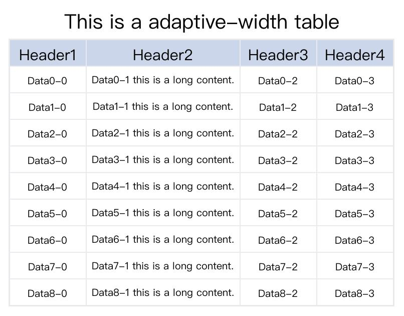
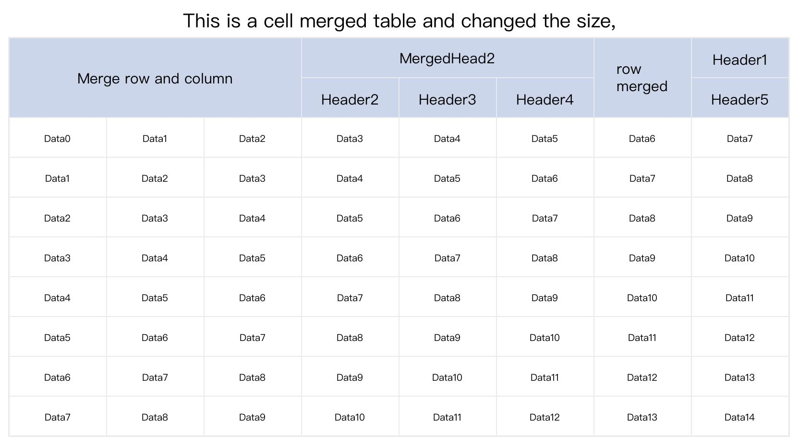
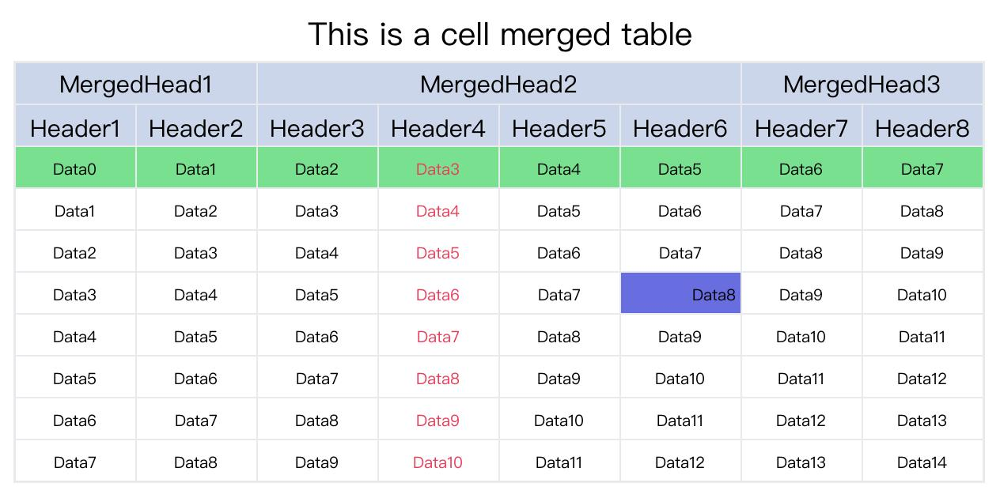

<!--
 * @Author: xinyan
 * @Date: 2023-11-02 19:07:09
 * @LastEditors: xinyan
 * @LastEditTime: 2023-11-02 19:38:43
 * @Description: file content
-->

# TablePic
## 概述
这个包使用PIL（pillow）来生成包含表格的图片。它具有类似于matplotlib的table的功能，但包括更多的自定义选项。

## 安装

请使用pip来安装这个包。

```shell
pip install tablepic
```

## 版本说明
### v0.0.8
v0.0.4-v0.0.7之间进行了一些bug的修复，无太多功能性的修改。

v0.0.8版新增加图片合并的功能，用于将生成的多个表格图片合并到一张图里面。函数参数如下：

combine_multiple_pic
- combine_path: str, 合并后图片的路径
- path_list: list[str], 需要合并的图片的路径列表
- img_list: list[Image]，需要合并的图片对象列表（PIL中的Image对象，可以使用函数 generate_table_pic() 生成返回，也可以自定义生成）
- pic_bk_color: 生成图片的背景色，默认白色。

#### 已有图片的合并
使用示例如下：

```python
import tablepic as tp

pic_path_list = ['/tmp/pic1.png', '/tmp/pic2.png']
combine_path = '/tmp/combine_table.png'
tp.combine_multiple_pic(combine_path, pic_path_list)
```

生成结果如下：


#### 生成图片在合并
使用示例如下：

```python
import tablepic as tp

# pic1
title_list = [{'content': 'This is table 1'}]
header_dict = {'content': [f'Header{i+1}' for i in range(8)]}
data_dict = {'content':[[f'Data{i+j}' for j in range(8)] for i in range(9)]}
img1 = tp.generate_table_pic(10, 8, title_list=title_list, header_dict=header_dict, data_dict=data_dict)

# pic2
title_list = [{'content': 'This is table 2'}]
header_dict = {'content': [f'Header{i+1}' for i in range(5)]}
data_dict = {'content':[[f'Data{i+j}' for j in range(5)] for i in range(9)]}
img2 = tp.generate_table_pic(10, 5, title_list=title_list, header_dict=header_dict, data_dict=data_dict)

combine_path = './pic/combine_table.jpg'
tp.combine_multiple_pic(combine_path, img_list=[img1, img2])
```

生成结果如下：


### v0.0.4
在之前的版本中，所有列的默认宽度相同且固定。如果表格中内容的长度过长，会导致内容重叠，并且表格无法根据内容调整宽度。在v0.0.4版本中，添加了对表格内容宽度和高度的识别，自动为每个列和行设置适当的高度。

v0.0.4版本的结果：



在v0.0.3版本及之前的结果：


## 说明

### 基础表格

以下代码生成一个基本的表格图片，包含一个标题和一个10行8列的常规表格。表格有1行表头和9行数据。

```python
import tablepic as tp

title_list = [{'content': 'This is a title.'}]
header_dict = {'content': [f'Header{i+1}' for i in range(8)]}
data_dict = {'content':[[f'Data{i+j}' for j in range(8)] for i in range(9)]}

tp.generate_table_pic(10, 8, title_list=title_list, header_dict=header_dict,
                      data_dict=data_dict, img_path='./pic/basic_table1.jpg')
```

生成的图片如下所示：


如你所见，可以通过参数 `title_list` 设置多级标题。示例如下：

```python
import tablepic as tp

title_list = [{'content': 'This is a title.'}, {'content': 'This is a second title.'}, {'content': 'This is a third title.'}]
header_dict = {'content': [f'Header{i+1}' for i in range(8)]}
data_dict = {'content':[[f'Data{i+j}' for j in range(8)] for i in range(9)]}

tp.generate_table_pic(10, 8, title_list=title_list, header_dict=header_dict,
                      data_dict=data_dict, img_path='./pic/basic_table2.jpg')
```


还可以给图片添加脚注。如下所示：

```python
import tablepic as tp

title_list = [{'content': 'This is a title.'}, {'content': 'This is a second title.'}, {'content': 'This is a third title.'}]
header_dict = {'content': [f'Header{i+1}' for i in range(8)]}
data_dict = {'content':[[f'Data{i+j}' for j in range(8)] for i in range(9)]}
footnote_list = [{'content': 'This is a footnote.'}]
tp.generate_table_pic(10, 8, title_list=title_list, header_dict=header_dict,
                      data_dict=data_dict, img_path='./pic/basic_table3.jpg',
                      footnote_list=footnote_list)
```

生成的结果：


### 合并表头单元格
This package can also generate a table that has two rows for header or even more rows, and some some cells need to be merged. Let's see how to finish that.

Suppose I want to generate a table that has 2 rows for header, 8 columns, 8 data rows. So the table will be 10 rows * 8 columns, and the first row header only have
3 header text. Which means some cells will be merged. Assuming I want the first 2 cells to be merged, then merge 4 and 2 cells respectively among the remaining 6 cells.
So, there are 3+8=11 header texts, those texts will be assigned to the header_dict's key `content` as a list.

Then specify the merged dict, which tells how to merge the cells. In this example, the cell located at `(0,0), (0,2), (0,6)` needs merging. The cell `(0,0)` merge 1 column rightwards, the cell `(0,2)` merge 3 column rightwards, and the cell `(0,6)` merge 1 column rightwards. So the merged dict will be: `cell_merged_dict={'0-0':[0,1], '0-2':[0,3], '0-6':[0,1]}`.

这个包还可以生成具有两行或更多行表头的表格，并且还可以合并某些单元格。让我们看看如何完成这个任务。

假设我想生成一个具有2行表头、8列和8行数据的表格。因此，该表格将是10行*8列的。第一行表头只有3个单元格；也就是说，有些单元格需要合并。假设我想要合并前两个单元格，然后在剩下的6个单元格中分别合并4个和2个单元格。因此，总共有3+8=11个表头内容，这些表头内容需要赋值给参数 `header_dict` 的 `content` 键。

接下来需要设定合并字典，该字典将会告诉程序如何合并单元格。在这个例子中，位于(0,0), (0,2), (0,6)坐标的单元格需要合并。单元格(0,0)向右合并1列，单元格(0,2)向右合并3列，单元格(0,6)向右合并1列。因此，合并字典将是：`cell_merged_dict={'0-0':[0,1], '0-2':[0,3], '0-6':[0,1]}`。

> 说明: 参数中的 `'0-0':[0, 1]` 表示位于 `(0,0)` 坐标的单元格向下合并0行，向右合并1列。

```python
import tablepic as tp

title_list = [{'content': 'This is a cell merged table'}]
# 11 header text
header_dict = {'content': ['MergedHead1', 'MergedHead2','MergedHead3'] + [f'Header{i+1}' for i in range(8)]}
# 8 * 8 data content
data_dict = {'content':[[f'Data{i+j}' for j in range(8)] for i in range(8)]}
# cell merged info
cell_merge_dict = {'0-0':[0,1], '0-2':[0,3], '0-6':[0,1]}
tp.generate_table_pic(10, 8, title_list=title_list, header_dict=header_dict,
                      data_dict=data_dict, img_path='./pic/merged_table1.jpg',
                      cell_merge_dict=cell_merge_dict)
```

以上代码生成的结果如下：


接下来我们尝试同时合并行和列。在下面的示例中，位于 `(0,0)` 坐标的单元格将向下合并一行，并向右合并两列。这意味着位于坐标 `(0,1), (0,2) (1,0), (1,1), (1,2)` 的5个单元格将不存在了。位于坐标 `(0,3)` 的单元格向右合并1列；位于坐标 `(0,6)` 的单元格向下合并一行；因此，总共会有8个表头内容。

```python
import tablepic as tp

# merge row and column
title_list = [{'content': 'This is a cell merged table for row and column'}]
# 8 header text
header_dict = {'content': ['Merge row and column', 'MergedHead2','row\nmerged'] + [f'Header{i+1}' for i in range(5)]}
# 8 * 8 data content
data_dict = {'content':[[f'Data{i+j}' for j in range(8)] for i in range(8)]}
# cell merged info
cell_merge_dict = {'0-0':[1,2], '0-3':[0,2], '0-6':[1,0]}
tp.generate_table_pic(10, 8, title_list=title_list, header_dict=header_dict,
                      data_dict=data_dict, img_path='./pic/merged_table2.jpg',
                      cell_merge_dict=cell_merge_dict)
```

参数 `header_dict` 中的 `content` 键的值的顺序非常重要。表头将从左到右输出到单元格中，并且会跳过已合并的单元格。


> 补充：数据单元格合并的方式与表头相同。

### 修改宽度和高度

表格列的宽度默认为150像素，高度为50像素。可以通过参数 `cell_width, cell_height` 来修改（会影响所有行和列）。

```python
import tablepic as tp

# merge row and column
title_list = [{'content': 'This is a cell merged table and changed the size,'}]
# 8 header text
header_dict = {'content': ['Merge row and column', 'MergedHead2','row\nmerged'] + [f'Header{i+1}' for i in range(5)]}
# 8 * 8 data content
data_dict = {'content':[[f'Data{i+j}' for j in range(8)] for i in range(8)]}
# cell merged info
cell_merge_dict = {'0-0':[1,2], '0-3':[0,2], '0-6':[1,0]}
tp.generate_table_pic(10, 8, title_list=title_list, header_dict=header_dict,
                      data_dict=data_dict, img_path='./pic/change_size_table1.jpg',
                      cell_merge_dict=cell_merge_dict,
                      cell_width=200, cell_height=80)
```

以上代码生成的结果如下：




如果你只想修改某一列的宽度和某一行的高度，可以通过参数 `col_width_dict, row_height_dict` 完成。来看如何实现：

```python
import tablepic as tp

# merge row and column
title_list = [{'content': 'This is a cell merged table and changed the size,'}]
# 8 header text
header_dict = {'content': ['Merge row and column', 'MergedHead2','row merged'] + [f'Header{i+1}' for i in range(5)]}
# 8 * 8 data content
data_dict = {'content':[[f'Data{i+j}' for j in range(8)] for i in range(8)]}
# cell merged info
cell_merge_dict = {'0-0':[1,2], '0-3':[0,2], '0-6':[1,0]}
tp.generate_table_pic(10, 8, title_list=title_list, header_dict=header_dict,
                      data_dict=data_dict, img_path='./pic/change_size_table2.jpg',
                      cell_merge_dict=cell_merge_dict,
                      col_width_dict={6:300}, row_height_dict={5:80})
```

以上代码中将第7列的宽度修改为300像素，其他列将会使用默认宽度150像素。第6行的高度修改为80像素，其他行使用默认的告诉50像素。当然，你可以通过 `cell_width, cell_height` 修改其他行和列的默认高度和宽度。


### 修改标题样式

标题的字体、字号、颜色、对齐方式和标题高度都可以进行更改。参数 `title_list` 的元素是一个字典，它具有以下有效的键：
- content：必需，标题的内容。
- font_size：可选，标题的字号，默认值为40（主标题）和30（副标题）。
- color：可选，标题的颜色，默认值为'#000000'，即白色。
- align：可选，标题的对齐方式，默认值为'center'，其他有效值为'left'和'right'。
- height：可选，标题的高度，默认值为80（主标题）和60（副标题）。

> 主标题指的是title_list的第一个元素，其他为副标题。

让我们看一个例子。


```python
import tablepic as tp

# Modify the style of the title.
title_list = [{'content': 'This is a cell merged table', 'font_size': 80, 'color':'#EE00DD', 'height': 100},
    {'content': 'This is a subtitle', 'color':'#0000FF', 'align':'right'}]
# 11 header text
header_dict = {'content': ['MergedHead1', 'MergedHead2','MergedHead3'] + [f'Header{i+1}' for i in range(8)]}
# 8 * 8 data content
data_dict = {'content':[[f'Data{i+j}' for j in range(8)] for i in range(8)]}
# cell merged info
cell_merge_dict = {'0-0':[0,1], '0-2':[0,3], '0-6':[0,1]}
tp.generate_table_pic(10, 8, title_list=title_list, header_dict=header_dict,
                      data_dict=data_dict, img_path='./pic/title_style_table.jpg',
                      cell_merge_dict=cell_merge_dict)
```

以上代码生成的结果如下：


### 修改表头样式

参数 `header_dict` 还有其他键来修改表头的样式。有效的键包括：
- content：必需，列表，表头的内容。
- font_size：可选，整数或字典，表头的字号。如果指定了整数值，它将将所有表头的字号设置为指定值。通过使用字典，您可以为不同的表头设置不同的字号。默认字号为30。
- bk_color：可选，字符串或字典，表头单元格的背景颜色。如果指定了字符串值，它将将所有表头的背景颜色设置为指定值。通过使用字典，您可以为不同的表头设置不同的背景颜色。默认值为'#CCD6EB'。
- fore_color：可选，字符串或字典，表头的文本颜色，与 `bk_color` 使用相同。默认值为'#000000'（黑色）。
- align：可选，字符串或字典，表头的对齐方式，与 `bk_color` 使用相同。默认值为'center'，其他有效值为'left'和'right'。

当给参数 `font_size, bk_color, fore_color, align` 赋值字典时，字典的key是表头内容的索引。让我们看一个例子。


```python
import tablepic as tp

title_list = [{'content': 'This is a cell merged table'}]
# Modify the header style.
header_dict = {'content': ['MergedHead1', 'MergedHead2','MergedHead3'] + [f'Header{i+1}' for i in range(8)],
    'font_size': {1: 45},
    'bk_color': '#BADC58',
    'align': {0:'left', 2:'right'},
    'fore_color': {0:'#B71540', 1: '#6F1E51', 2:'#546DE5'}}
# 8 * 8 data content
data_dict = {'content':[[f'Data{i+j}' for j in range(8)] for i in range(8)]}
# cell merged info
cell_merge_dict = {'0-0':[0,1], '0-2':[0,3], '0-6':[0,1]}
tp.generate_table_pic(10, 8, title_list=title_list, header_dict=header_dict,
                      data_dict=data_dict, img_path='./pic/header_style_table.jpg',
                      cell_merge_dict=cell_merge_dict)
```

以上代码生成的结果如下：


### 修改数据内容样式

参数 `data_dict` 具有以下有效的key：
- content：必需，二维列表，数据的内容。
- font_size：可选，整数或字典，数据的字号。如果指定了整数值，它将将所有数据单元格的字号设置为指定值。通过使用字典，您可以为不同的数据单元格设置不同的字号。默认字号为20。
- bk_color：可选，字符串或字典，数据单元格的背景颜色。如果指定了字符串值，它将将所有数据单元格的背景颜色设置为指定值。通过使用字典，您可以为不同的数据单元格设置不同的背景颜色。默认值为'#FFFFFF'。
- fore_color：可选，字符串或字典，数据单元格的文本颜色，与bk_color使用方法相同。默认值为'#000000'（黑色）。
- align：可选，字符串或字典，数据单元格的对齐方式，与bk_color使用方法相同。默认值为'center'，其他有效值为'left'和'right'。

当给参数 `font_size, bk_color, fore_color, align` 赋值字典时，字典的key是表头内容的索引。让我们看一个例子。


当给参数 `font_size, bk_color, fore_color, align` 赋值字典时，其key可以是以下三种类型：
- 行索引: `r0` 表示第一行数据，样式将会影响整一行
- 列索引: `c2` 表示第三列数据，样式将会影响整一列
- 单元格坐标: `2-3` 表示位于第三行第四列的单元格，样式仅应用于该单元格

来看一个示例：

```python
import tablepic as tp

title_list = [{'content': 'This is a cell merged table'}]
# Modify the header style.
header_dict = {'content': ['MergedHead1', 'MergedHead2','MergedHead3'] + [f'Header{i+1}' for i in range(8)]}
# 8 * 8 data content
data_dict = {'content':[[f'Data{i+j}' for j in range(8)] for i in range(8)],
    'font_size': 20,
    'bk_color': {'r0': '#78E08F'},
    'fore_color': {'c3': '#EB3B5A'},
    'align': {'3-5': 'right'}
    }
# cell merged info
cell_merge_dict = {'0-0':[0,1], '0-2':[0,3], '0-6':[0,1]}
tp.generate_table_pic(10, 8, title_list=title_list, header_dict=header_dict,
                      data_dict=data_dict, img_path='./pic/data_style_table.jpg',
                      cell_merge_dict=cell_merge_dict)
```




### 修改字体

目前，标题、表头、数据内容过的字体不能单独设置，当设定字体文件后，所有内容都会使用该字体呈现。

```python
import tablepic as tp

# Change Font
font_path = 'Users/xinyan/Library/Fonts/sarasa-mono-sc-regular.ttf'
title_list = [{'content': 'This is a cell merged table'}]
# Modify the header style.
header_dict = {'content': ['MergedHead1', 'MergedHead2','MergedHead3'] + [f'Header{i+1}' for i in range(8)]}
# 8 * 8 data content
data_dict = {'content':[[f'Data{i+j}' for j in range(8)] for i in range(8)],
    'font_size': 20,
    'bk_color': {'r0': '#78E08F', '3-5': '#686DE0'},
    'fore_color': {'c3': '#EB3B5A'},
    'align': {'3-5': 'right'}
    }
# cell merged info
cell_merge_dict = {'0-0':[0,1], '0-2':[0,3], '0-6':[0,1]}
tp.generate_table_pic(10, 8, title_list=title_list, header_dict=header_dict,
                      data_dict=data_dict, img_path='./pic/font_style_table.jpg',
                      font_path=font_path,
                      cell_merge_dict=cell_merge_dict)
```

生成的结果如下：


### 修改背景颜色和表格线的颜色

可以通过参数 `pic_bk_color` 来修改整个表格的背景颜色，表格的线条颜色可以通过参数 `table_line_color` 指定。来看一个示例：


```python
import tablepic as tp

title_list = [{'content': 'This is a cell merged table'}]
# Modify the header style.
header_dict = {'content': ['MergedHead1', 'MergedHead2','MergedHead3'] + [f'Header{i+1}' for i in range(8)]}
# 8 * 8 data content
data_dict = {'content':[[f'Data{i+j}' for j in range(8)] for i in range(8)],
    'font_size': 20,
    'bk_color': {'r0': '#78E08F', '3-5': '#686DE0'},
    'fore_color': {'c3': '#EB3B5A'},
    'align': {'3-5': 'right'}
    }
# cell merged info
cell_merge_dict = {'0-0':[0,1], '0-2':[0,3], '0-6':[0,1]}
tp.generate_table_pic(10, 8, title_list=title_list, header_dict=header_dict,
                      data_dict=data_dict, img_path='./pic/bk_style_table.jpg',
                      font_path=font_path,
                      cell_merge_dict=cell_merge_dict,
                      pic_bk_color='#DFE4EA',
                      table_line_color='#2F3542')
```


# 重点

数据单元格不能合并，因为目前是直接传递一个二维数组，暂不考虑该情况。未来也许会考虑。

# 许可

请参见[许可文件](LICENSE)。